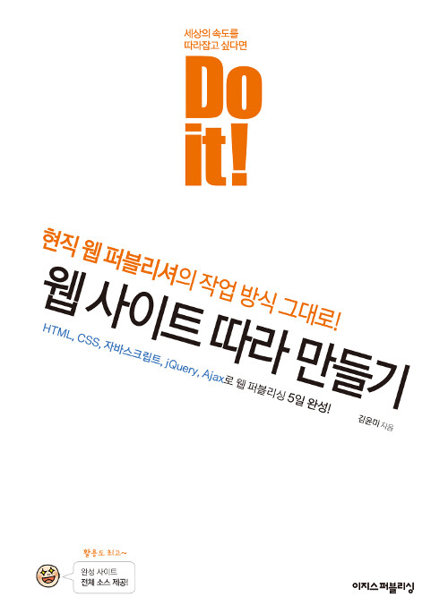

# Do it! 웹 사이트 따라 만들기

`HTML` `CSS` `JavaScript` `JQuery` `Ajax`

## 개요

이 저장소는 **Do it! 웹 사이트 따라 만들기**의 학습 내용이 정리되어 있습니다.

> 김윤미

## 학습 목표
- HTML, CSS, JavaScript 체계적 복습
- Ajax 실무 학습
- 웹 기획 실무 학습

## 학습 결과
[결과물 바로가기](https://hwahyeon.github.io/book-doit-website)

## 학습 내용
|No|목차|핵심 학습 내용|
|---|---|---|
|01|실습 전 익혀야 할 기본 지식|· web 기본 지식|
|02|개발 환경 준비하기|· Cross Browsing|
|03|전체 레이아웃 만들기|· Layout   · 가상 요소|
|04|페이지 이동 효과 만들기|· JQuery|
|05|회사소개 페이지 만들기|· CSS Animation|
|06|도서소개 페이지 만들기|· |
|07|도서소개 페이지 추가하기|· Ajax   · 3D Motion|
|08|FAQ 페이지 만들기||
|09|Contact Us 페이지 만들기|· Form|
|10|구글 API로 Contact Us 폼 처리하기|· Web hosting|

